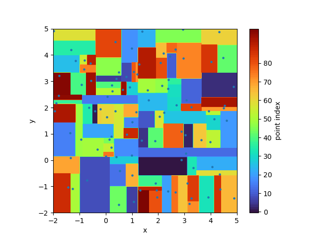
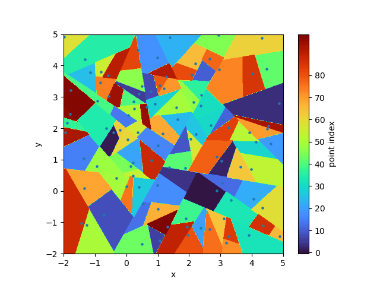

# QuickNodeSearch
Quick node search for solution interpolation in mesh adaptation

## Example of partition aligned to coordinates of space with 100 points:

----

## Example of partition unaligned to coordinates of space with 100 points:

----

Author: 

Sourabh Bhat <heySourabh@gmail.com>
